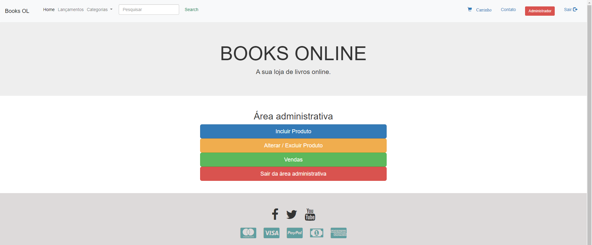

## Resumo

- Este é um projeto do curso de programação WEB do professor André Mauricio, onde desenvolvemos uma pequena loja de livros online, com administrador, login, cadastro de livros e até um pequeno controle de estoque com entradas e saídas das teóricas vendas.

## Tecnologias

- Dentro do mesmo desenvolvemos boas noções em PHP, MySQL, HTML e um pouco do framework Bootstrap 5

